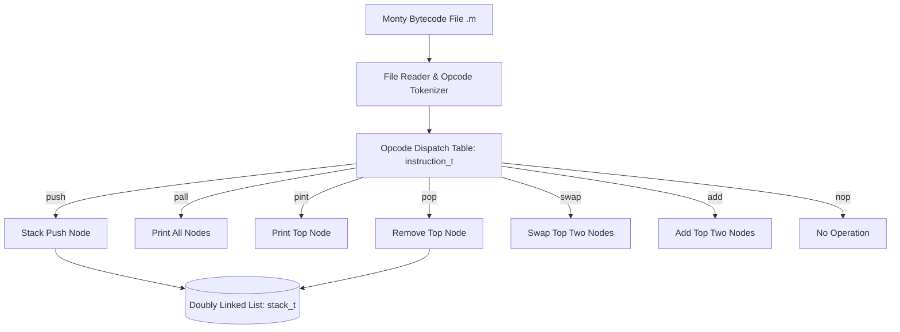

# Monty 0.98 Bytecode Interpreter in C

A lightweight, high-performance bytecode interpreter written in C that parses and executes Monty 0.98 scripting files operating on a unique dual-mode LIFO Stack and FIFO Queue data structure.



## Architecture

The interpreter reads Monty bytecode instructions line-by-line from a script file, tokenizes the opcode and optional arguments, and invokes the matching function pointer from an opcode lookup table.

### Data Structures

The underlying memory model uses a doubly-linked list (`stack_t`):

```c
typedef struct stack_s
{
    int n;
    struct stack_s *prev;
    struct stack_s *next;
} stack_t;
```

### Supported Opcodes

- `push <int>`: Pushes an integer onto the top of the stack.
- `pall`: Prints all values on the stack starting from the top.
- `pint`: Prints the value at the top of the stack followed by a newline.
- `pop`: Removes the top element of the stack.
- `swap`: Swaps the top two elements of the stack.
- `add`: Adds the top two elements of the stack, storing the result in the second element.
- `nop`: Does not do anything.

## Compilation & Execution

```bash
gcc -Wall -Werror -Wextra -pedantic -std=gnu89 *.c -o monty
./monty bytecodes/00.m
```
